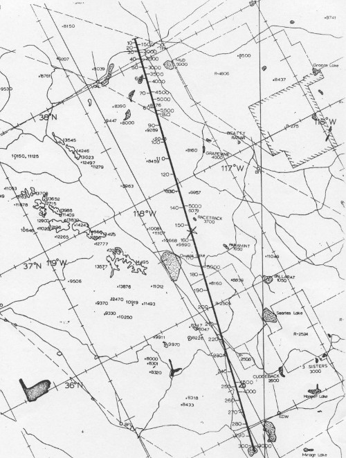

Flightpath analysis for UAV (fpaUAV)
===

Το έργο "Flightpath Analysis for UAV" αποτελεί μία προσπάθεια ανάλυσης και αυτοματοποίησης των διαδρομών (flightpaths) που ακολουθούν οι μη επανδρωμένες πλατφόρμες (UAVs). Τα flight paths αποτελούν τις εναέριες διαδρομές που καλούνται να εκτελέσουν τα UAVs. Ο εκάστοτε χρήστης μπορεί είτε μέσω ενός προγράμματος να δημιουργήσει αυτά τα flightpaths και να αναλύσει τα χαρακτηριστικά τους. Ειδικότερα θα χρησιμοποιηθεί η γλώσσα **R** και συγκεκριμένα το πρόγραμμα **Rstudio**. Τα τρία flightpaths που θα αναπτυχθούν είναι τα: **expanding pattern**, **creeping line** και **circle**. Και τα τρία μοτίβα θα αναπτυχθούν με τη χρήση του πακέτου TurtleGraphics και θα προστεθούν δυνατότητες εξαγωγής σε shapefiles για χρήση σε GIS συστήματα αλλά και σε KML για χρήση σε λογισμικά τύπου **GoogleEarth**. 

Η χρησιμότητα της ανάλυσης flightpath έχει να κάνει με αποστολές έρευνας-διάσωσης (SAR), εποπτείας περιοχών (πυροσβεστική, Λιμενικό Σώμα, δασαρχείο, κ.α.) και ανθρώπινων εργασιών (εργοτάξιο, εκδηλώσεις, κ.α.). Στο παρόν έργο θα αναλυθούν τρία βασικά flightpaths μέσω της χρήσης λογισμικού ΕΛΛΑΚ. 

Για το **Expanding pattern**, το σημείο έναρξης πτήσης ορίζεται στο κέντρο της εκάστοτε περιοχής μελέτης. Χαρακτηρίζεται από ευθύγραμμα τμήματα που δημιουργούν “τετράγωνα” και το πλήθος αυτών  καθώς και το μήκος ορίζεται από το χρήστη. Συγκεκριμένα το μήκος των ευθύγραμμων τμημάτων διπλασιάζεται ανά δύο. Χρησιμοποιείται ευρέως σε περιπτώσεις θαλάσσιων ατυχημάτων κατά τη διαδικασία εύρεσης ατόμων στα θαλάσσια ύδατα (και σε άλλες εφαρμογές). 

Για το **Creeping line** το σημείο έναρξης πτήσης για αυτό το μοτίβο ορίζεται σε περιοχές στα άκρα της περιοχής μελέτης(π.χ κάποια γωνία). Η μη επανδρωμένη πλατφόρμα ακολουθώντας το pattern εκτελεί πτήση σε ευθύγραμμα τμήματα  που ουσιαστικά είναι “μη ολοκληρωμένα ορθογώνια”. Όλες οι παράλληλες πλευρές αυτού του μοτίβου χαρακτηρίζονται από το ίδιο μήκος. Και σε αυτή την περίπτωση ο χρήστης ορίζει το πλήθος και το μέγεθος των ευθύγραμμων τμημάτων.  Το creeping line χρησιμοποιείται ευρέως για την επιτήρηση των καλλιεργειών(και σε άλλες εφαρμογές).

Για το **Circle pattern** ο εκάστοτε χρήστης θα πρέπει ανάλογα με την εφαρμογή να ορίσει την ακτίνα, δηλαδή την απόσταση από το κέντρο της περιοχής. Η απόσταση αυτή θα καθορίσει το σημείο μέχρι το οποίο θα πετάξει σε ευθεία η μη επανδρωμένη πλατφόρμα και έπειτα θα διαγράψει κυκλική πορεία. Το μοτίβο αυτό μπορεί να χρησιμοποιηθεί τόσο για την ανεύρεση ναυαγών – ατόμων στη θάλασσα όσο και για την εποπτεία δασικών εκτάσεων για την αποφυγή πυρκαγιών. 

